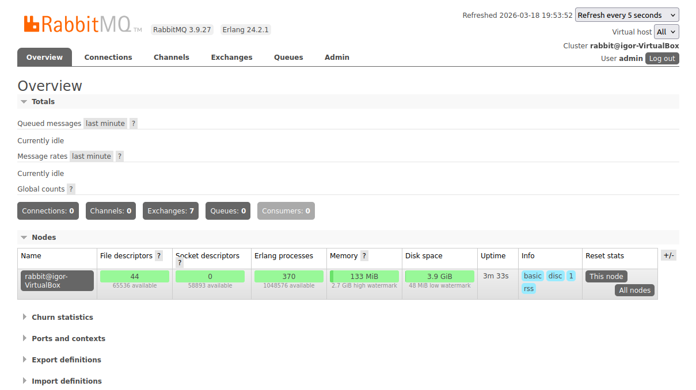
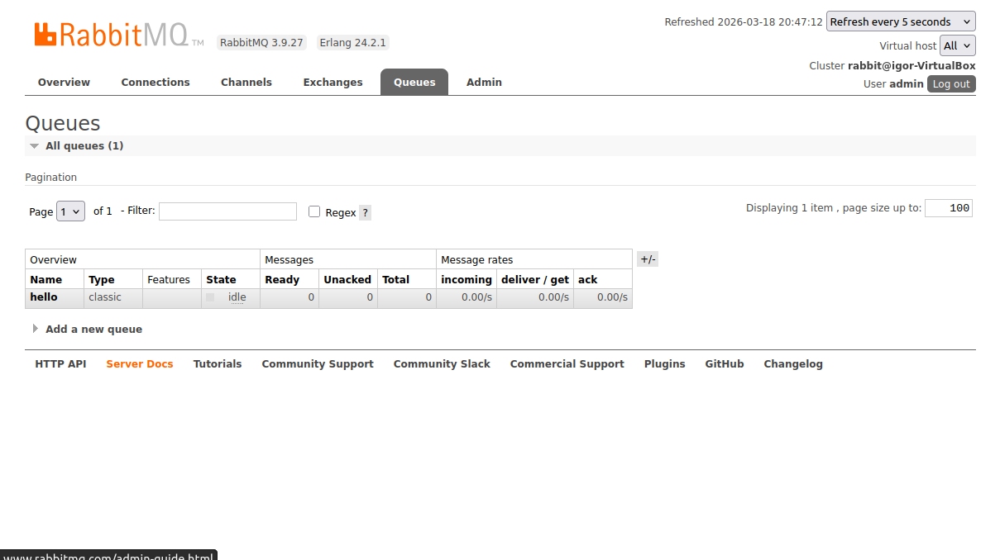
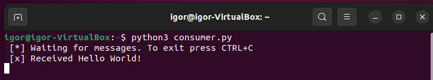
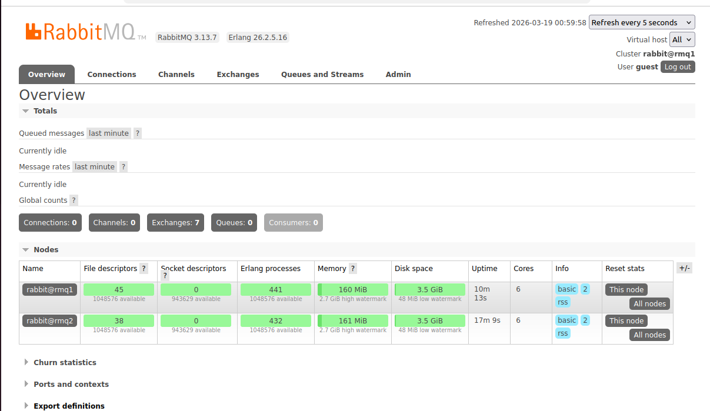
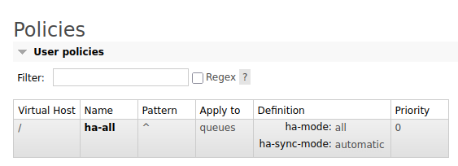
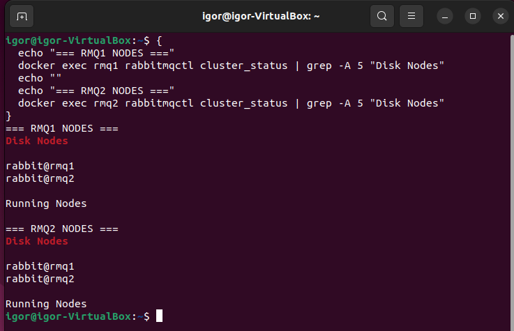
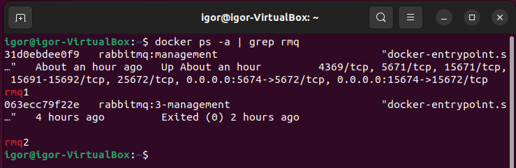
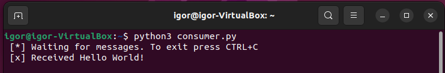

# Домашнее задание к занятию «Очереди RabbitMQ»
Выполнил: Береснев Игорь Андреевич

---

## Задание 1. 

Используя Vagrant или VirtualBox, создайте виртуальную машину и установите RabbitMQ. Добавьте management plug-in и зайдите в веб-интерфейс.

Итогом выполнения домашнего задания будет приложенный скриншот веб-интерфейса RabbitMQ.

### Скриншот веб-интерфейс RabbitMQ

## Задание 2.

Используя приложенные скрипты, проведите тестовую отправку и получение сообщения. Для отправки сообщений необходимо запустить скрипт producer.py.

Для работы скриптов вам необходимо установить Python версии 3 и библиотеку Pika. Также в скриптах нужно указать IP-адрес машины, на которой запущен RabbitMQ, заменив localhost на нужный IP.

$ pip install pika

Зайдите в веб-интерфейс, найдите очередь под названием hello и сделайте скриншот. После чего запустите второй скрипт consumer.py и сделайте скриншот результата выполнения скрипта

В качестве решения домашнего задания приложите оба скриншота, сделанных на этапе выполнения.

Для закрепления материала можете попробовать модифицировать скрипты, чтобы поменять название очереди и отправляемое сообщение.

### Скриншот очередь hello

### Скриншот скрипта consumer.py

Задание 3.

Используя Vagrant или VirtualBox, создайте вторую виртуальную машину и установите RabbitMQ. Добавьте в файл hosts название и IP-адрес каждой машины, чтобы машины могли видеть друг друга по имени.

Пример содержимого hosts файла:

$ cat /etc/hosts
192.168.0.10 rmq01
192.168.0.11 rmq02

После этого ваши машины могут пинговаться по имени.

Затем объедините две машины в кластер и создайте политику ha-all на все очереди.

В качестве решения домашнего задания приложите скриншоты из веб-интерфейса с информацией о доступных нодах в кластере и включённой политикой.

Также приложите вывод команды с двух нод:

$ rabbitmqctl cluster_status

Для закрепления материала снова запустите скрипт producer.py и приложите скриншот выполнения команды на каждой из нод:

$ rabbitmqadmin get queue='hello'

После чего попробуйте отключить одну из нод, желательно ту, к которой подключались из скрипта, затем поправьте параметры подключения в скрипте consumer.py на вторую ноду и запустите его.

Приложите скриншот результата работы второго скрипта.

### Скриншот Веб-интерфейса с двумя нодами

### Скриншот Политики ha-all

### Скриншот cluster_status с двух нод

### Скриншот остановленного rmq2

### Скриншот скрипта consumer.py

